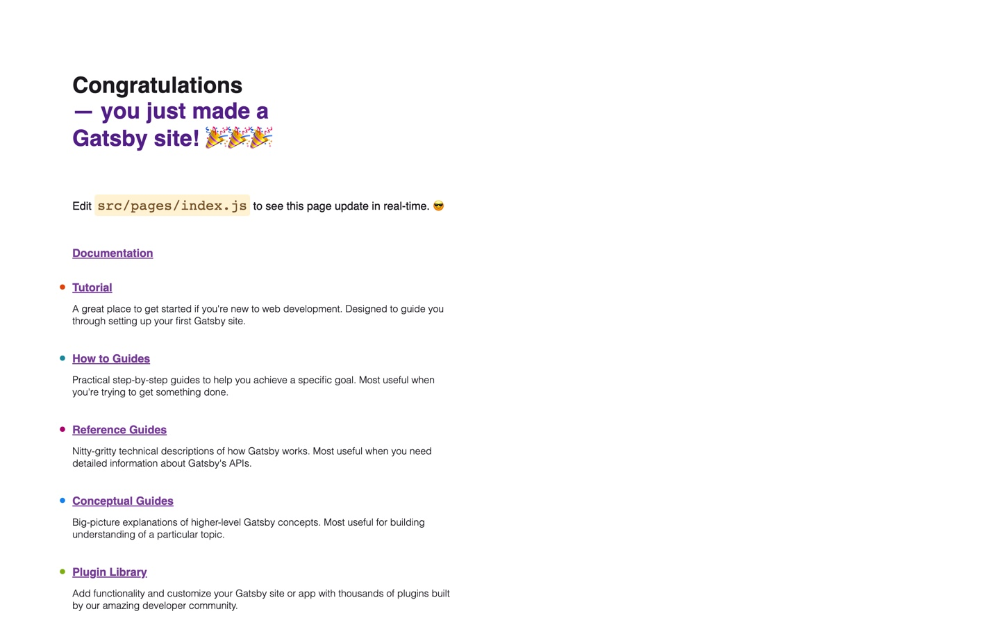

In this tutorial we will go over how to create a blog using gatsby.

### Installation

Use a curl command to install <a href="https://brew.sh/" target="_blank">Homebrew</a> inside the /bin/bash directory <br/>

###### Open your terminal and run
```shell
/bin/bash -c "$(curl -fsSL https://raw.githubusercontent.com/Homebrew/install/HEAD/install.sh)"
```

###### Use brew to install Node
```
brew install node 
```
###### Use node to install gatsby
```
npm install gatsby
```

###### Use npm to initialize gatsby project

```
npm init gatsby
```
Change into your project directory
```
cd gatsby-starter-blog
```

This is what your project should look like
```
my-gatsby-site/
▸ node_modules/
▸ public/
▸ src/
  gatsby-config.js
  package-lock.json
  package.json
  README.md
```

### Run a Gatsby preview server

###### Lets see what this gatsby starter site looks like, run the following command
```
npm run develop
```



