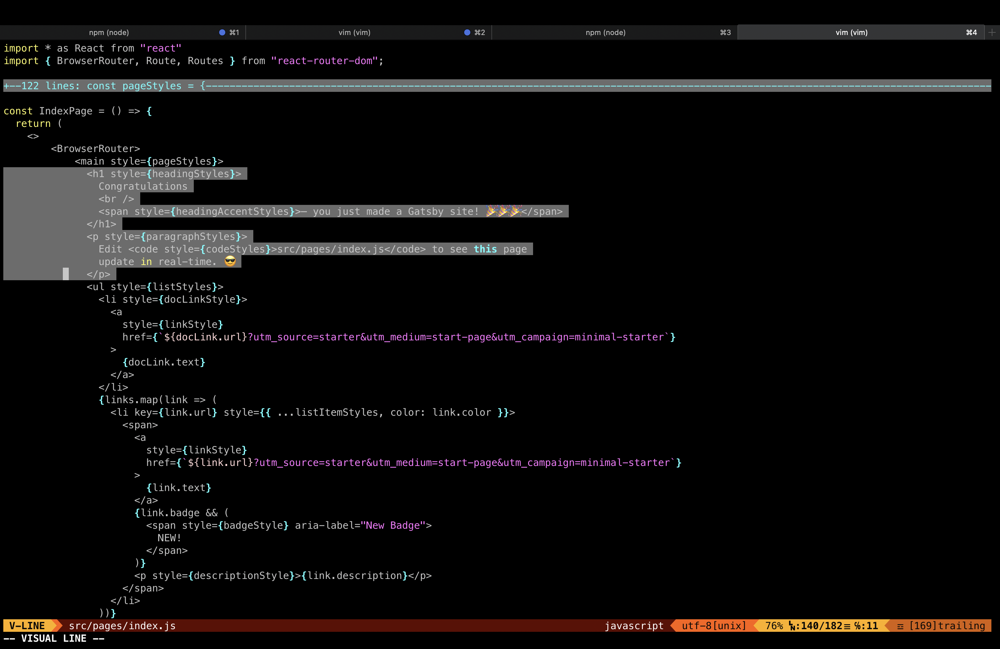
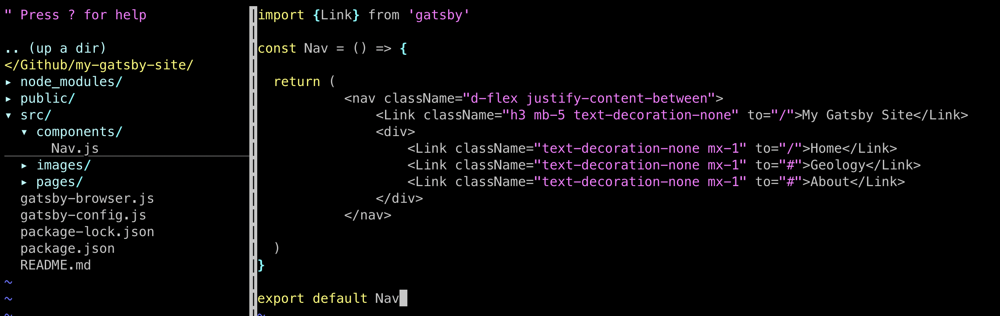
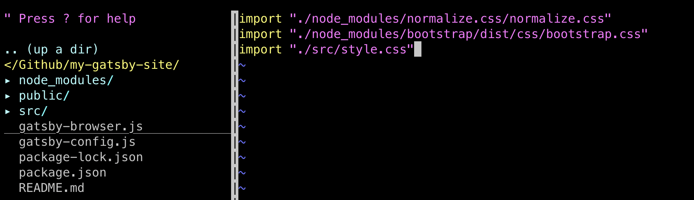
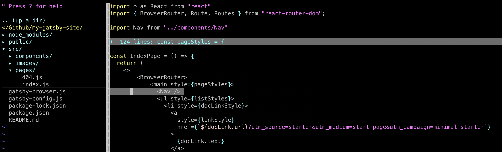
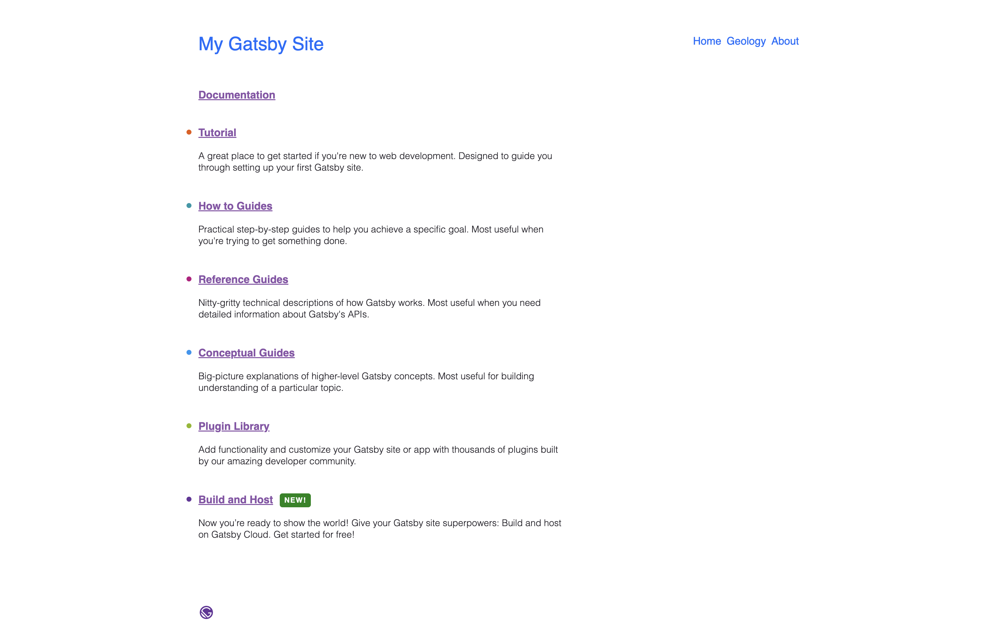

In this tutorial we will do the following:

    - Delete the congratulations message

    - Use normalize.css to guarantee consistency of css styling with all browsers

    - Create a navbar component and use bootstrap for styling

### Edit Homepage

When you ran the Gatsby preview server, it says to edit src/pages/index.js so lets give that a try.

Lets start off by deleting the congradulations message and the line it says to edit the src/pages/index.js file



### Navbar component

Lets go ahead and add a navbar

Create file src/components/Navbar.js



I sprinkled some bootstrap to quickly style this Nav component, create a file called gatsby-browser.js in the root folder of your project. Here is were you import your css. It is best practice to always use normalize.css because diffrent browsers interpret styling in there own ways and this makes sure your styling is consitant in every browser. 

### Install bootstrap and normalize

To get bootstrap just install it using ```npm install bootstrap```

To get normalize.css just install it using ```npm install normalize.css```

Import them inside ```gatsby-browser.js```



### Importing our navbar

Lets import this component into our homepage ```src/pages/index.js```



Your page should now look like this




